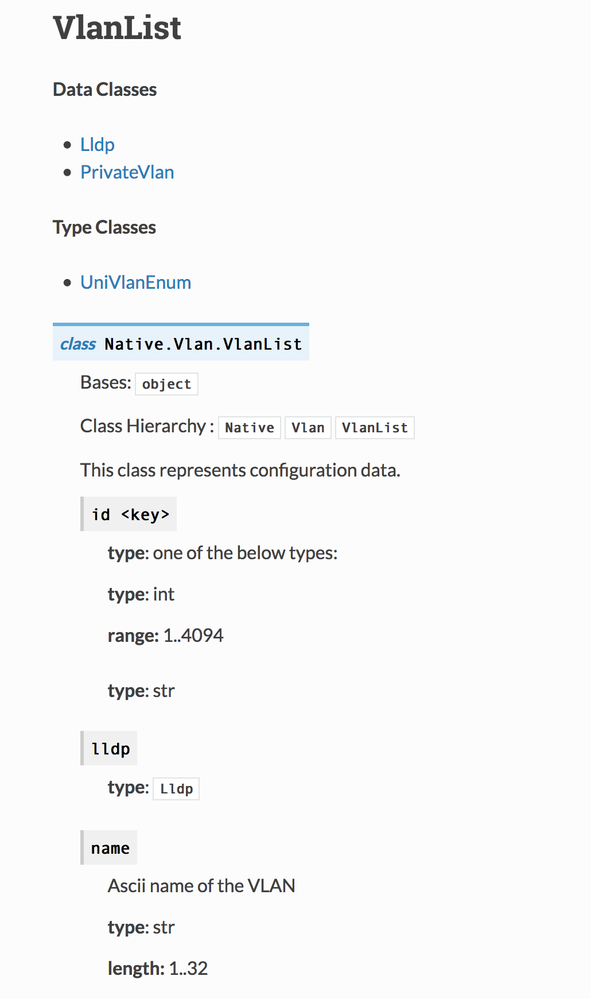

# Getting To Know YDK

New to the concepts behind model-based management?  Maybe you've heard of YANG, but you're not sure
how to navigate YANG modules to find what you're looking for.  Or maybe you've found the YANG path
that will do what you want, but you're not sure how to use it to achieve your desired results.

The one thing you do know is that you need to automate stuff.   You need to scale the creation of
new services from the application down to the network.  You want to take the concepts you've been
used to when it comes to network configuration, and get them plugged in to an automation framework
that will give you quick and reliable control over your network operations.

Let's say you have a campus network composed of Catalyst 3850 switches, and you want to
programmatically create new VLANs on these switches using YANG-based NETCONF.  You want to create
a Python script that will push the VLAN changes to the required switches.  Instead of building NETCONF
remote procedure calls directly, you want to use the [YANG Development Kit (YDK)](https://developer.cisco.com/site/ydk/)
to write object-oriented Python code to do this.

First, let's make sure YANG-based NETCONF is enabled on the device.  To do that, do the following:

```
Switch#config t
Switch(config)#netconf-yang
```

Once NETCONF is enabled, you can connect to port 830 via SSH to get a list of YANG modules supported
by the device.  This is done by doing the following:

```
$ ssh -p 830 user@switch -s netconf
<?xml version="1.0" encoding="UTF-8"?>
<hello xmlns="urn:ietf:params:xml:ns:netconf:base:1.0">
<capabilities>
<capability>urn:ietf:params:netconf:base:1.0</capability>
<capability>urn:ietf:params:netconf:base:1.1</capability>
<capability>urn:ietf:params:netconf:capability:writable-running:1.0</capability>
<capability>urn:ietf:params:netconf:capability:xpath:1.0</capability>
...
<capability>http://cisco.com/ns/yang/Cisco-IOS-XE-vlan?module=Cisco-IOS-XE-vlan&amp;revision=2017-02-07</capability>
...
```

You'll note in the `hello` message from the device, one of the modules is the `Cisco-IOS-XE-vlan` module.
This sounds promising to help us create a new VLAN, but how would we have found that if the module didn't contain the
word _vlan_?  To search for available YANG modules using keywords, use the [YANG Catalog Search](https://yangcatalog.org/yang-search/).
From there, you can filter the results based on vendor (say _cisco_), and then cross-reference the module results with the
list of modules returned in the `hello` message shown above.

While we can download the modules directly from the device, all of Cisco's YANG modules can be found in [GitHub](https://github.com/YangModels/yang)
by cloning the `https://github.com/YangModels/yang.git` repository:

```
$ git clone https://github.com/YangModels/yang
```

Assuming your switches are running 16.5(1), you can find all of the supported YANG modules in the `yang/vendor/cisco/xe/1651` sub-directory.

Now that you have found a module that seems like it will work, and you have a local copy of all of the modules; let's look at the module's
structure.  While you can read the module directly with a text editor, it is often easier (and more user-friendly) to use the `pyang` tool to
view the module's tree output.  Pyang is a Python-based tool for working with YANG modules.  You can install pyang with
the following command:

```
$ pip install pyang
```

When you have pyang installed, do the following to get the tree output:

```
$ cd yang/vendor/cisco/xe/1651
$ pyang -f tree Cisco-IOS-XE-vlan.yang
module: Cisco-IOS-XE-vlan
  augment /ios:native/ios:vlan:
    +--rw access-map* [name]
    |  +--rw name      string
    |  +--rw value?    uint16
    |  +--rw action?   enumeration
    |  +--rw match
    |     +--rw ipv6
    |     |  +--rw address*   string
    |     +--rw ip
    |        +--rw address*   string
    +--rw configuration* [vlan-id]
    |  +--rw vlan-id    union
    |  +--rw ip
    |     +--rw flow
    |        +--rw monitor* [flow-monitor]
    |           +--rw flow-monitor    string
    |           +--rw input?          empty
    |           +--rw output?         empty
...
```

There's a lot of output here, and it might get confusing as to where to start.  Let's look towards the top.  In particular,
note the `augment /ios:native` bit.  This indicates that the `Cisco-IOS-XE-vlan` module augments another module that has a
namespace of `ios`.  If you open the `Cisco-IOS-XE-vlan.yang` file in a text editor, you will see the following close to the
top of the file:

```
import Cisco-IOS-XE-native {
    prefix ios;
  }
```

This means that the `Cisco-IOS-XE-vlan` module augments the `Cisco-IOS-XE-native.yang` module.  This is important, because when it
comes to YDK, the YDK module will refer to the native module rather than the vlan module.

Something else to note about Cisco _native_ modules: they kind of resemble the CLI with respect to how the nodes are structured.
That is, if you're used to configuring something like the following:

```
vlan 2003
 name LAB
```

Then you'll likely find something similar starting at the `/ios:native` branch of the tree.  Specifically to VLANs, a switch
typically contains a number of VLANs (i.e., a _list_ of VLANs).  If we look back through the tree output we got from pyang, we
see the following:

```
+--rw vlan-list* [id]
   +--rw id              union
   +--rw remote-span?    empty
   +--rw private-vlan {ios-features:private-vlan}?
   |  +--rw primary?       empty
   |  +--rw association?   string
   |  +--rw community?     empty
   |  +--rw isolated?      empty
   +--rw name?           string
   +--rw lldp
   |  +--rw run?   empty
   +--rw uni-vlan?       enumeration
```

This looks promising.  When we configure a VLAN using the CLI, it has an ID, it can be a remote-span VLAN, it has a name, etc.
The characters next to the nodes in the tree snippet above indicate that the `vlan-list` node is a read-write or _config_ node.
It can consist of zero or more entries.  Each entry **must** have an `id` property and can have optional properties like a name
(the '?' denotes that a property is optional).

If we now work backwards in the tree, we can build a YANG path that will lead to the specific set of nodes we want to modify.
At the top of the tree, we're at `/ios:native/ios:vlan`.  From there, we move to `vlan-list`.  So our path to add a new VLAN
will begin at `/ios:native/ios:vlan/vlan-list`.

Now that we have the path we need, let's install the YDK and the packages for the IOS-XE modules.  This can be done with the
following command:

```
$ pip install ydk-models-cisco-ios-xe
```

This will install everything you need.  But, if you run into problems, have a look at the [YDK GitHub page](https://github.com/CiscoDevNet/ydk-py).

In order to find the specific Python module name, class, and properties needed to create a VLAN, we can explore the
[YDK IOS-XE docs](xr.cisco.com/py/docs/ydk.models.cisco_ios_xe.html).  You'll note there is no `Cisco_IOS_XE_vlan` Python module
here.  Remember, since the `Cisco-IOS-XE-vlan` module augments the `Cisco-IOS-XE-native` module, we should look at the
`Cisco_IOS_XE_native` module and classes.  Since our starting point was `/ios:native/ios:vlan/vlan-list`, click down through the
`Cisco_IOS_XE_native` classes to the **Native > Vlan > VlanList** class.  Here we see the properties we expect based on the
pyang tree we generated before.



Let's start to construct our script to create a new VLAN.  We know the module we need (`Cisco_IOS_XE_native`), and we know the properties`
we want to set (create a VLAN with an ID and a name).

```python
from ydk.models.cisco_ios_xe.Cisco_IOS_XE_native import Native
from ydk.services import CRUDService
from ydk.providers import NetconfServiceProvider
import argparse

...

  def create_vlan(self):
    vlan = Native.Vlan()
    vlan_list_inst = Native.Vlan.VlanList()
    vlan_list_inst.id = self.vid
    vlan_list_inst.name = self.vname
    vlan.vlan_list.append(vlan_list_inst)

    try:
      self.cs.create(self.ne, vlan)
    except Exception as e:
      print('Error adding VLAN {} to {}: {}'.format(
        self.vid, self.device, e))
      return False

    return True
```

Let's break this down.  First, an instance of `Native.Vlan` is created.  This will serve as an anchor point for our
Create-Update-Read-Delete (CRUD) operation.  Next, an instance of a `Native.Vlan.VlanList` is created.  This may be confusing.
Even though the class is named _VlanList_, we are creating an instance of a VLAN within the list.  This instance is assigned our
VLAN ID and our VLAN name.  Finally, this instance is appended to the `vlan_list` object rooted at the `Native.Vlan` object.

Once the `Vlan` object instance has been properly defined, it can be pushed to the device via the CRUDService.  Assuming this returns
successfully, inspecting the running configuration on the device in question will show the newly created VLAN.  The full script can
be found below:

```python
#!/usr/bin/env python

from ydk.models.cisco_ios_xe.Cisco_IOS_XE_native import Native
from ydk.services import CRUDService
from ydk.providers import NetconfServiceProvider
import argparse

class VlanCreator():

  def __init__(self, **kwargs):
    self.cs = CRUDService()
    self.ne = NetconfServiceProvider(
      address=kwargs['device'], port=kwargs['port'], username=kwargs['username'], password=kwargs['password'])

    self.vid = kwargs['vid']
    self.vname = kwargs['vname']

  def create_vlan(self):
    vlan = Native.Vlan()
    vlan_list_inst = Native.Vlan.VlanList()
    vlan_list_inst.id = self.vid
    vlan_list_inst.name = self.vname
    vlan.vlan_list.append(vlan_list_inst)

    try:
      self.cs.create(self.ne, vlan)
    except Exception as e:
      print('Error adding VLAN {} to {}: {}'.format(
        self.vid, self.device, e))
      return False

    return True

if __name__ == '__main__':
  parser = argparse.ArgumentParser(description='Add a new VLAN to a Cisco IOS-XE switch')
  parser.add_argument('--vlanid', type=int, required=True, help='VLAN ID to add')
  parser.add_argument('--vlanname', type=str, required=True, help='VLAN Name')
  parser.add_argument('--device', type=str, required=True, help='Name or IP address of switch')
  parser.add_argument('--port', type=int, default=830, help='Port to use for NETCONF; default 830')
  parser.add_argument('--username', type=str, required=True, help='Username to use to connect to the device')
  parser.add_argument('--password', type=str, required=True, help='Password to use to connect to the device')
  args = parser.parse_args()

  vc = VlanCreator(device=args.device, port=args.port, username=args.username, password=args.password,
    vid=args.vlanid, vname=args.vlanname)

  result = vc.create_vlan()
  if result:
    print('VLAN {} was created successfully!'.format(args.vlanid))

```

The script can be run using the following command:

```
$ vlans.py --vlanid 200 --vlanname LAB --device 10.1.1.10 --port 830 --username admin --password admin
VLAN 200 was created successfully!
```

After running it, confirm the VLAN was created on the switch:

```
Switch#show run | begin vlan 200
vlan 200
 name LAB
```

Will you have to do all of this each time you need to write use a YANG module or write a YDK script?  Not all of the steps.  As you
begin to get more comfortable with the structure of YANG modules and how they translate to YDK it should become second nature to
build powerful automation scripts using YANG and YDK.
